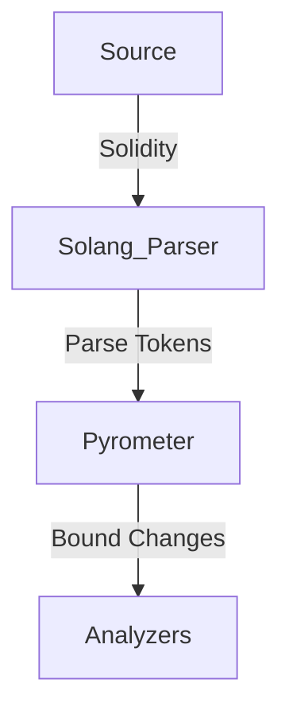
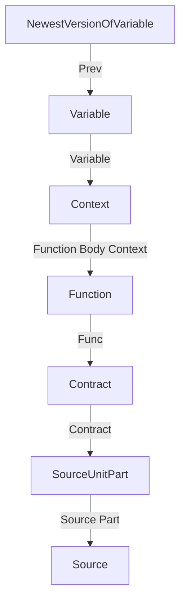
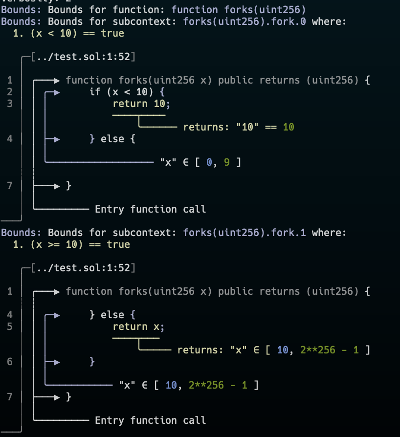

Pyrometer is structured as follows:




First we take in some solidity source and use `solang` to parse the raw text. This gives us the parsed solidity tokens (i.e. AST). From there, we take these tokens and start to build a graph of the contracts. 

## Parsing Solidity
Once we have ran the source through `solang`, we start building the graph. We delay analyzing any function bodies or function inputs until later to avoid a situation where we haven't added a user defined type (i.e. a `struct`) and instead just analyze `Contracts`, `Enums`, `Structs`, and `Function` definitions.

Once all user types and imports are handled, we can start analyzing function bodies. This is handled by the `parse_ctx_stmt` & `parse_ctx_expr`. The difference between `parse_*` and `parse_ctx_*` is whether they are done within a function body. 

## Graph Architecture
The graph is heirarchial in a lot of ways - everything flows up to a more senior element. For example, a variable points to a previous version of that variable, which flows to the function that created the variable, which points to the contract, which points to a source unit part, which points to a source unit.


In general, the codebase works on graph indices, not the actual underlying data structure. The graph holds the `Node` enum and connects elements via the `Edge` enum. 


### Analyzing a function body
A function body consists of `Statement`s which are made up of `Expression`s. We take statements and construct a `Context` - this context state keeps track of things like what function we are in, if there are child or fork contexts, if this context is an internal or external function call, etc. Upon creating the context, we load in the function inputs as a `ContextVar` and add it to the graph and get back a `ContextVarNode`. Once this `ContextVarNode` is created, it mostly should never change, giving us a sort of SSA form. Whenever an operation occurs on the variable, we duplicate it and add a new `ContextVar` into the graph, and connect the two `ContextVarNode`s via an `Edge::Context(ContextEdge::Prev)`. This lets you find the earliest version of a variable or the latest version of a variable by following the graph connections.

Each `ContextVar` has a `VarType` - this represents the type of the variable (e.g. `uint256` would be `VarType::Builtin`). Each solidity type has 2 forms: `Concrete` and `Builtin`. A `Concrete` is a raw number, i.e. `uint256(1337)` would be `Concrete::Uint(256, 1337)`. A `Builtin` is used when we know the type but it takes a range of values.

#### Parsing an expression
When we encounter an expression, we recursively parse its parts (most expressinos have subexpressions). This generates `ExprRet`, or an expression return, that takes a few forms: `Single`, `Multi`, `Fork`,  or `CtxKilled`. This generally holds the variable that the original expression cared about.

As an example:
```solidity
uint256 c = a + b;
```

Would break down to roughly:
```rust
Statement::VariableDefinition(
	Expression::Variable("c"),
	Expression::Add(
		Expression::Variable("a"),
		Expression::Variable("b"),
	)
)	
```

When we parse `Expression::Variable("a")`, we look into the context for an attached `ContextVarNode` whose name is "a". When we find it, we return `ExprRet::Single((ctx, a_as_cvar_node))` and continue on parsing up the expression tree.

## Bounds/Ranges
When we create a `VarType::Builtin`, we implicitly also create a `bound` or a `range`. The easiest way to think about this is for a simple type: `uint256`. By default, we know that this variable type *must* be between 0 and `type(uint256).max` (`2**256 - 1`).

As we parse expressions, those expressions can change the range/bounds. Take for example a `require` expression: `require(a == 100)`. We can leverage the fact that if `a != 100`, the transaction would revert ending execution, and we want to model this in the bounds. And so, when we see a `require`, we can set the bounds for the variable based on the input, e.g. `a`'s bounds would be `a `∈` [100, 100]` due the require statement. If it is a math, bitwise, or some other operation, that can further changes the bounds. Sometimes an expression actually increases the bounds, but this is generally undesirable as it indicates a lack of knowledge about what the program will do.

## World Forking
One interesting aspect of this analysis is what happens when there is an `if` statement. In this case, it splits the world in two. One world in which the `if` statement evaluates to true and another where it evaluates to false. Take this function for example:
```solidity
function forks(uint256 x) public returns (uint256) {
	if (x < 10) {
		return 10;
	} else {
		return x;
	}
}
```

We would fork a `Context` into two subcontexts, one in which  `x `∈` [ 0, 9 ]` , and one where  `x `∈` [ 10, 2**256 - 1 ]`.  You can see the output of this here:


Notice the `where` statements in the output, telling you `x >= 10` for one and `x < 10` for the other. After we fork the world we continue to parse the expression body.


Those are the core aspects of Pyrometer needed to know to hop in the codebase.