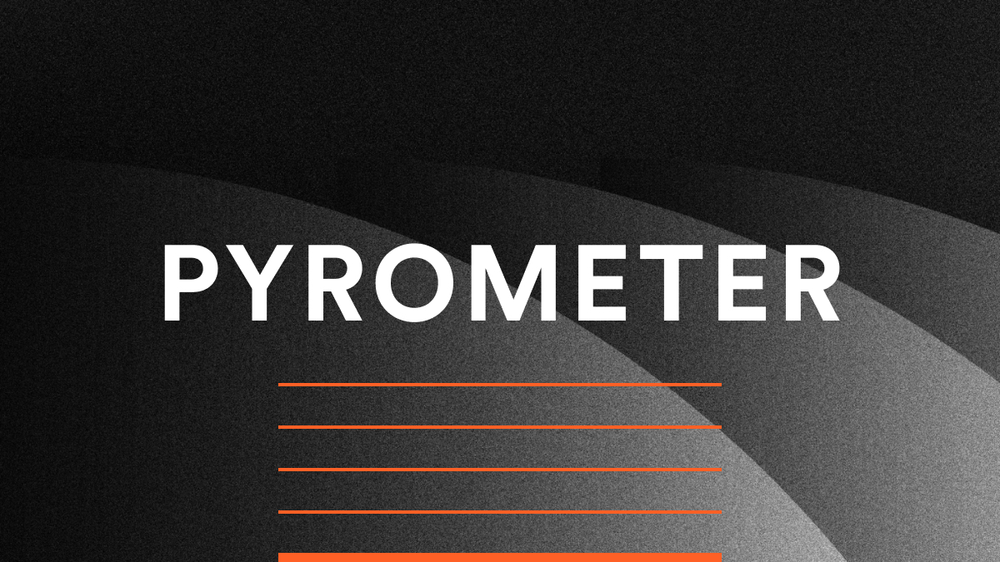
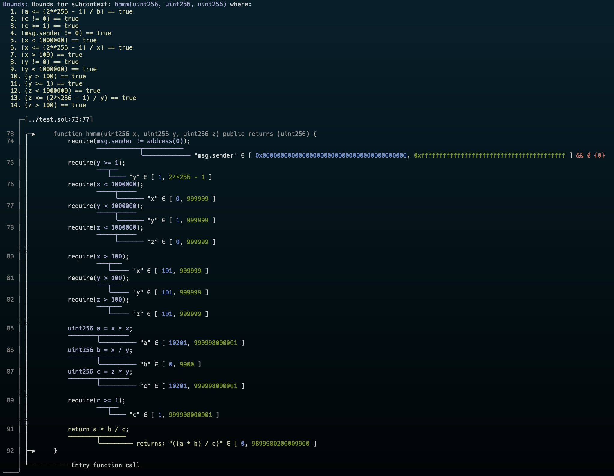
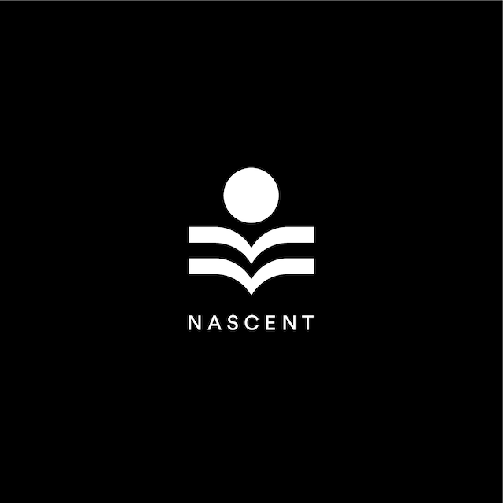

# 🔥🔫 Pyrometer 🔥🔫

[![Telegram Chat][tg-badge]][tg-url]

[tg-badge]: https://img.shields.io/endpoint?color=neon&logo=telegram&label=chat&style=flat-square&url=https%3A%2F%2Ftg.sumanjay.workers.dev%2Fpyrometer
[tg-url]: https://t.me/pyrometer

Pyrometer is a work-in-progress security tool currently in _ALPHA_. We are releasing it in its current stage to find contributors and adventurous users (that don't mind when the tool breaks).

Effectively, Pyrometer is a mix of symbolic execution, abstract interpretation, and static analysis - we take ideas from each and apply them with an *engineering first* mindset to create an effective tool (and avoid nerdsnipes by academic papers) aiming to help both auditors and developers.

Pyrometer may eventually be language agnostic, but for now it is targeting Solidity. The code isn't currently entirely structured for multi-language support, but it has some of the bones to be able to support other EVM-targeting languages.

Here is an example output:



## Can I use it today?
Yes\*. There are going to be issues and crashes, see the [TODO](#TODO) below before opening an issue. In general, it doesn't take too long to add a language feature, but actually listing all the features of Solidity hasn't been done to keep track. Right now, Pyrometer shines for analyzing math and access control, but is in rapid development supporting a broader set of use cases. Some of the analyzers listed below would be extremely quick to implement but better language support has been the priority thus far. 

## How can I use it?
First, make sure rust is installed:
```bash
curl --proto '=https' --tlsv1.2 -sSf https://sh.rustup.rs | sh
```

Then:
```bash
git clone https://github.com/nascentxyz/pyrometer
cd pyrometer/cli
cargo install --path . --locked
pyrometer <PATH_TO_SOLIDITY_FILE>
```

Make sure `$CARGO_HOME/bin` is in your `$PATH`.

Binaries will eventually be built and released for version upgrades.


### Configuring Pyrometer
Pyrometer has a few different levels of verbosity, via the cli flag `-v` through `-vvvvv` (same as foundry). Documentation on these different levels hasn't been made as it is subject to change, though more `v`'s == more output. If you have trouble with imports, either wait a few days for me to improve them or use `forge flatten` from foundry and run Pyrometer on the output of that.

Sometimes you want high verbosity but only for a set of contracts or functions. You can pass `--contracts MyContract --contracts MyOtherContract` or `--funcs myFunc --funcs myOtherFuncs` to limit output to just those contracts/functions.

In addition to basic bound analysis, there are 2 other analyzers that are semi-built out. Think of these more as demos for what can be built on top of the analysis Pyrometer does. The more useful of these is the `Access Control Querier` - add `--access-query "MyContract.myStorageVarName"` to a Pyrometer run and explore.


## How does it work?
See the [Architecture](./ARCHITECTURE.md) page for details. 

## Understanding the output

You will generally see a line underlined followed by the `∈` symbol followed by  `[ minimum possible value, maximum possible value ]`. `∈` indicates set membership and means "is an element of", and the brackets indicate an *interval* - so for example, if you see:

` "x" ∈ [ 0, 10 ] && ∉ { 5 }`, you can read this as "x is in the range 0 to 10, excluding 5". Each solidity type has their own default bounds. If you see `"x" == 3`, `x` must be 3 at that point in the program.


## Contributing
Read the [Architecture](./ARCHITECTURE.md) page first, then start hacking. Hop in the telegram (see badge above) to ask questions. While "a mix of symbolic execution, abstract interpretation, and static analysis" sounds like magic, under the hood most concepts are relatively simple, so don't be afraid to dive in! Testing & CI aren't setup yet. The idea is to use the `test_data` folder and ensure none of the require statements error out as well as reading the contracts and ensuring the structure is as expected.

## TODO
- [ ] General
    - [ ] Cleanup repo (remove unnecessary files, automate testing, etc.)
    - [ ] Graceful error handling
    - [ ] Trait/Lang separation cleanup
    - [ ] Propogate requirements across variables (i.e. `y = x;` & `x != 0;` therefore `y != 0;`)
- [ ] Language
    - [ ] Better import handling (`foundry.toml` reading?)
    - [ ] User Types, i.e. `type MyType is uint256;`
    - [ ] Better Library handling
    - [ ] Operator overloading
    - [ ] Storage
        - [ ] Consider constructor
        - [ ] Consider non-constructor initializer
    - [ ] Functions
        - [x] Call modifier at start of function analysis
        - [x] Call modifiers when calling another function from within a function
        - [ ] Handle virtual/overriding
    - [ ] Consider `unchecked` math
        - [ ] Keep uncheckedness for the entire block
        - [ ] Pass uncheckedness into `bin_op`
    - [ ] Support `assembly`
    - [ ] Improve Support for `for/while` loops
        - [ ] Be smarter about the variables by looking at max num of iters and determine if we should just unroll & execute it
        - [ ] Take a guess at the gas usage inside the body of the for-loop and try to set upper bounds
    - [x] Support `++i/i++/--i/i++`
    - [ ] Support low-level call
- [ ] Analyzers
    - [ ] Bound Analyzer
        - [ ] Cleanup CLI output
        - [x] Fix multiple calls to single function that don't show
    - [ ] Taint Analyzer
    - [ ] Gas Optimization Analyzer
        - [ ] Unchecked Recommendation Analyzer
        - [ ] Storage Variable Initialization Analyzer
    - [ ] Invariant Analyzer
    - [ ] Reentrancy Analyzer
- [ ] Queries
    - [ ] Access Control Querier
        - [ ] Cleanup output
    - [ ] Code Path Querier
- [ ] Long term
    - [ ] GUI for better exploring code execution forks
    - [ ] LSP/IDE integration
    - [ ] DSL for writing queries
    - [ ] Export bounds for SMT solvers (z3, cvc5, etc.)

<br/><br/>
<p align="center">
    
</p>
